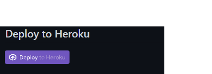
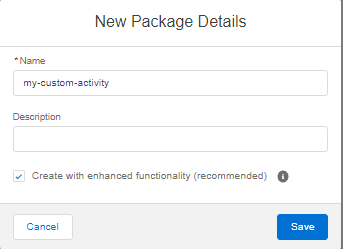
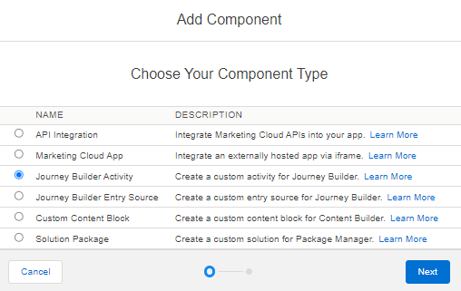
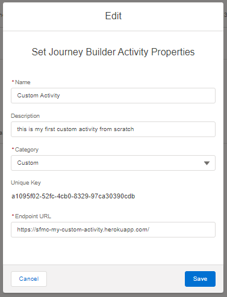
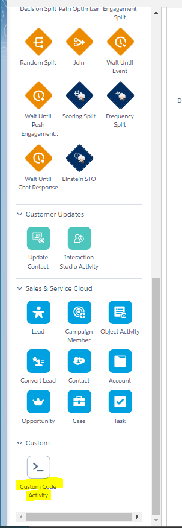

# Installing Custom Activity
A Custom Activity in Marketing Cloud is simply a web application that is iframed into the SFMC UI. You can choose to host your web application on any site, but we'll be using Heroku to host this project. If you haven't created a Heroku account for yourself yet, please do so now. 

Once you have a Heroku account, you can deploy your web application to it which creates a URL that can be used to access your application at any time. Marketing Cloud uses the URL that Heroku creates for your application to iframe into it's journey builder UI. 

Installing a Custom Activity into your own Marketing Cloud instance is actually quite easy and only takes 5 minutes! To do so, follow these steps: 
1. Deploy code to Heroku
2. Create a Marketing Cloud Installed Package 

## 1. Deploy Code to Heroku
We've made it super easy for you to deploy this project to your own Heroku account! Simply go to this project's [github page](https://github.com/balwillSFDC/sfmc-my-custom-acitivty), and click the "Deploy to Heroku" button - Make sure you're logged into Heroku!


After clicking the "Deploy to Heroku" button, a new tab will open in Heroku and ask you to specify the name of your project in Heroku (don't worry, the name in Heroku won't show in SFMC) and __voilà__ ✨ - you deployed this project to your own Heroku account!

## 2. Create a Marketing Cloud Installed Package 
After deploying the project to Heroku, create a Marketing Cloud install package - An install package is used to create API integrations, install custom apps or add custom Journey Builder components in Marketing Cloud. __You'll need administrator privleges to do thise__ 

To create an installed package, navigate to __Marketing Cloud > Setup > Apps > Installed Packages__ and click the "New" button and give your package a name (leave the "Create with enhanced functionality" checked) then click "Save". 

*Note, this Custom Activity does not use any Marketing Cloud APIs, even though it is receiving information from journey builder. If this Custom Activity was using SFMC APIs, an API Integration component would need to be created*



Within your installed pacakge, click "Add Component" and select "Journey Builder Activity" 



You'll then be prompted to enter the properties for your Journey Builder Activity. The __Name__ defined here will NOT display within the Journey Builder UI. Similarly, the __Category__ selected will determine what section your activity falls under in the Journey Builder Canvas UI. Finally, the __Endpoint URL__ is the URL journey builder uses to iframe your app into the UI. 


Now, when you navigate to Journey Builder you should see the Custom Activity under the Category selected above. 



*Note, the name of the custom activity and the icon used are defined in the ```config.json``` file.*

